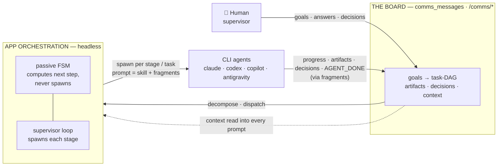
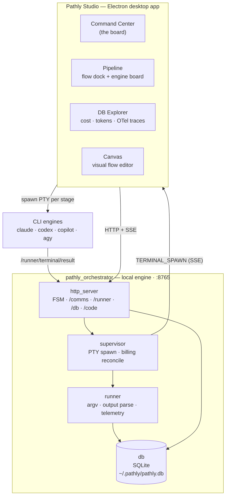
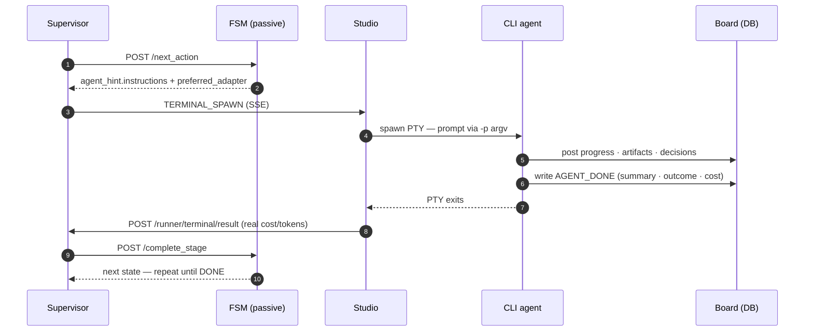

# Pathly

**Pathly is a board-driven control plane for orchestrating *headless* multi-agent software development.** You set goals on a visual board; an application drives AI coding agents (Claude Code, Codex, Copilot, Antigravity) through a governed pipeline — one step at a time, **no human in the per-step loop** — while you supervise, answer questions, and adjudicate decisions.

```
   HUMAN (supervisor)         THE BOARD                 APP            CLI AGENTS
   sets goals / decisions ──►  goals → task-DAG ──►  orchestrates ──►  claude / codex
        ▲                      artifacts/decisions     headlessly        / copilot / …
        └──────────────────────  context  ◄───────  results, progress, artifacts
                                              (agents connect back via "fragments")
```

Typing `/pathly` commands into a single CLI by hand is a **secondary** mode — handy, but not the design center. **New here? Read [docs/WHAT_IS_PATHLY.md](docs/WHAT_IS_PATHLY.md) first** — it explains the board concept and how a headless run works, with diagrams.

## Why Pathly?

Pathly exists to make multi-agent coding **supervised, not babysat** — and **auditable, not a black box**. Instead of hand-feeding one CLI prompt after another and watching context evaporate between steps, you set a goal on the board and let the app run the agents for you.

- **You supervise; the app runs the loop.** Set goals, answer questions, adjudicate decisions — the app spawns each agent headlessly, one step at a time, with no human in the per-step loop. Come back to a finished stage, not a blinking cursor.
- **The board is shared, durable memory.** Goals, decisions, discoveries, and artifacts live on a board and are read back into *every* agent prompt. Agents inherit context instead of rediscovering it; decisions become governance, not guesswork.
- **One pipeline, any engine.** Drive Claude Code, Codex, Copilot, and Antigravity through the same governed flow — and pick the best engine per stage. No lock-in to a single vendor's agent.
- **Quality is built into the flow.** PLAN → DESIGN → BUILD → REVIEW → TEST → RETRO, with adversarial review and acceptance testing as first-class stages — not one hopeful one-shot.
- **You see what it did and what it cost.** Every spawn is billed through one chokepoint: per-feature and per-flow cost/token rollups, OpenTelemetry traces, and a live engine board. No surprise bills, no mystery work.
- **Parallel without collisions.** Goals decompose into a task-DAG; a scheduler runs independent tasks concurrently with per-file claims so parallel agents never clobber each other's writes.
- **Resilient by design.** The SQLite board is the single source of truth; state survives restarts and can be rebuilt deterministically from the event log.

This repository (`pathly-adapters`) is two things in one package: the **installer/stitcher** that deploys agent + skill files into your AI host tools, *and* the **local orchestration engine** (FSM HTTP server + SQLite board) that the Pathly Studio desktop app drives.

## Architecture at a glance

**The loop** — the human seeds the board, the app decides and spawns the next agent, the agent connects back through *fragments*, and the app advances until done:



**The stack** — a local engine on `:8765` (Python) driven by the Studio desktop app; the engine emits `TERMINAL_SPAWN` over SSE, Studio opens a PTY per stage, and the CLI's result flows back:



**A single headless stage** — the FSM decides, the supervisor spawns, the agent works + reports, the loop advances:



## Install (end users)

Requires Python 3.11+. Install [pipx](https://pipx.pypa.io) if you don't have it:

```bash
pip install pipx
pipx ensurepath
```

Then install Pathly:

```bash
pipx install pathly-adapters
```

`pipx` keeps the package in its own isolated environment and puts `pathly-setup` on your PATH automatically — no virtual environment to manage, no activation step.

## Quick start

```bash
pathly-setup --dry-run    # preview what will be installed
pathly-setup --apply      # install into all detected hosts
```

That's it. Pathly detects Claude Code, Codex, Copilot, and Antigravity automatically.

Then open Claude Code in your project directory and start:

```
/pathly start            ← welcome screen + pick what to do
/pathly go               ← describe what you want; director routes it
/pathly build            ← implement next conversation
/pathly end              ← retro + archive
```

All commands go through `/pathly`. See [docs/FLOW_DIAGRAM.md](docs/FLOW_DIAGRAM.md) for the full command reference.

> **Tip:** `/start` and `/pathly start` are equivalent. `/pathly` dispatches to the same skill; direct invocation skips the dispatcher.

> **Primary mode — headless:** the `/pathly` commands above are the *interactive* path. The design center is the board — launch Studio (`pathly-studio`), set a goal, and hit **Start**; the app drives the pipeline agent-by-agent (each stage a visible terminal) while you supervise. See [docs/WHAT_IS_PATHLY.md](docs/WHAT_IS_PATHLY.md).

## All commands

```bash
pathly-setup                        # detect hosts; launch interactive menu
pathly-setup --dry-run              # preview what would be written
pathly-setup --apply                # install into all detected hosts
pathly-setup claude --apply         # install for Claude Code only
pathly-setup codex --apply          # install for Codex only
pathly-setup copilot --apply        # install for Copilot / VS Code only
pathly-setup antigravity --apply    # install for Antigravity (Gemini CLI) only
pathly-setup --repair               # overwrite Pathly-owned files
pathly-setup --force                # overwrite all files, even non-Pathly-owned
pathly-setup --uninstall            # remove all Pathly-owned files
pathly-events summary <feature>     # print token/cost table for a pipeline run
pathly-state <feature>              # print current FSM state for a feature
pathly-tokens                       # print token/cost summary across all pipeline runs
pathly-validate-flow <flow.yaml>    # validate a flow YAML against the FSM schema
pathly-studio                       # launch the local Pathly Studio desktop UI
```

`--dry-run` never writes. `--apply` is required for any writes.

## Supported Hosts

| Host | Detected by | Installed locations |
|------|-------------|---------------------|
| `claude` | `~/.claude/` directory exists | `~/.claude/agents/` (behavioral contracts)<br>`~/.claude/skills/` (skill folders) |
| `codex` | Codex config directory exists | `~/.codex/agents/` + `~/.agents/skills/` + local plugin marketplace |
| `copilot` | VS Code + Copilot detected | `~/.vscode/extensions/pathly/agents/`<br>`~/.vscode/extensions/pathly/skills/` |
| `antigravity` | `~/.gemini/antigravity-cli/` directory exists | `~/.gemini/antigravity-cli/agents/`<br>`~/.gemini/antigravity-cli/skills/` |

## How It Works

1. **Detect** — scans for installed hosts on the current machine.
2. **Stitch** — combines `core/agents/` and `core/skills/` content with adapter-specific `_meta/<name>.yaml` to produce deployable agent and skill files. Codex skills also receive a host execution contract that resolves host-neutral role directions against capabilities exposed in the active Codex session.
3. **Materialize** — writes stitched files to the host config location. A manifest tracks Pathly-owned files; `--repair` overwrites owned files, `--force` overwrites everything. Install is atomic — if anything fails, already-written files are rolled back.
4. **Register Codex plugin** - for Codex installs, writes `~/.codex/pathly-marketplace`, enables `pathly@pathly-local`, and refreshes the marketplace through the Codex CLI when available.

## FSM HTTP Server

Pathly skills communicate with the Python FSM engine over HTTP. The server runs locally on port 8765 and is auto-started by the `fsm-call` skill when needed - no manual setup required.

```
POST http://127.0.0.1:8765/next_action            ← get current state + agent instructions
POST http://127.0.0.1:8765/complete_stage         ← advance FSM to next state
POST http://127.0.0.1:8765/record_activity        ← write telemetry to ~/.pathly/activity.jsonl
GET  http://127.0.0.1:8765/events/stream          ← SSE stream of EVENTS.jsonl
GET  http://127.0.0.1:8765/events/runner?topic=X  ← SSE stream of runner events (used by Studio)
GET  http://127.0.0.1:8765/health                 ← liveness check
POST http://127.0.0.1:8765/shutdown               ← graceful server exit (used by Electron on restart)

# Runner endpoints (Studio ↔ supervisor)
POST http://127.0.0.1:8765/runner/start
POST http://127.0.0.1:8765/runner/pause
POST http://127.0.0.1:8765/runner/resume
POST http://127.0.0.1:8765/runner/advance
POST http://127.0.0.1:8765/runner/retry
POST http://127.0.0.1:8765/runner/abort
POST http://127.0.0.1:8765/runner/terminal/result    ← PTY exit callback from Studio
POST http://127.0.0.1:8765/runner/terminal/started   ← PTY started confirmation from Studio
```

**Authentication:** `POST` routes require the `X-Pathly-Secret` header for browser-origin or non-loopback callers (the secret's job is blocking browser CSRF); Pathly's own loopback agents call the board via plain curl and are intentionally exempt. The secret is a 64-char hex token auto-generated on first run and stored at `~/.pathly/server_secret.txt`. Studio reads and injects it automatically. `GET /events/*` endpoints are exempt (EventSource API cannot send custom headers). See [docs/SECURITY.md](docs/SECURITY.md#fsm-server-authentication).

**State storage:** The FSM uses SQLite (WAL mode) at `~/.pathly/pathly.db`. Each Flask thread gets its own connection via `threading.local()`. A single process-wide `threading.RLock` (`_global_write_lock`, reentrant) serializes all in-process writers — SQLite WAL + `busy_timeout=5000` handle cross-process contention. Flow definitions are stored in the `flow_definitions` table and refreshed from disk YAML on every server start.

Start it manually if needed:
```bash
pathly-fsm-http
# or: python -m pathly_orchestrator.http_server
```

The `fsm-call` skill (shared by all FSM-using skills) handles health-check, auto-start, and the HTTP POST — skills never call the server directly.

## Pathly Studio

This repository also ships Pathly Studio, a local Electron UI for inspecting and
driving Pathly workflows:

The panels live in the sidebar **PANELS** nav:

- **Command Center**: the board — goals, task-DAGs, artifacts, decisions, and questions. The primary supervisory surface; goal and per-task runs start here.
- **Pipeline**: a **global live engine board** (every running CLI engine — board runs, editor one-shots, and manual REPLs alike) as the main content, with a **collapsible right-side flow dock** beside it — the selected flow rendered as a vertical stepper (any built-in *or* user-created flow shows its real phases, current stage highlighted), the runner controls (pause / resume / reroute / abort), and tabs to switch between concurrently-running flows. Click a stage to reconfigure its host/agent/skill.
- **DB Explorer**: telemetry — per-feature and per-flow cost/token rollups, the event stream, and OpenTelemetry traces.
- **Markdown Editor**: edit project markdown with one-shot AI actions (Split, Analyze, Diagram) that spawn CLI agents against the open file.
- **Canvas**: visual flow editor — graph + raw YAML for `.flow.yaml` definitions, synced bidirectionally; Save writes via `PUT /flows/<name>`; export targets `pathly-package` / `claude-code` / `codex`.
- **Settings**: app + runtime configuration.

A floating **Engines** dock (`CliMonitorBar`) monitors every live CLI engine. A full **Terminal** hosts the PTY tabs — mini and full views share one xterm instance per `tabId` through `xtermRegistry` (hiding a view preserves the process; the bin action kills and removes the instance).

**How runs execute:** each pipeline stage spawns a visible terminal tab with the agent running non-interactively — skills are injected via argv at spawn time, so no disk-installed skill files are needed for automated runs. On stage completion the semantic result (and the `outcome` success/failed gate) comes from the last `AGENT_DONE` event — never subject to PTY truncation — while real `cost_usd` + tokens come from parsing the `--output-format=json` stdout (with a regex fallback that recovers them even when a large envelope overflows the PTY tail buffer). Every runner spawn is billed through one chokepoint (`POST /runner/terminal/result`), and a run that self-reports no `AGENT_DONE` still gets a synthesized one so it appears in the Monitor and is billed. A dual-cap spawn scheduler (`terminal.ts`) bounds concurrent engines: global ≤ 8, headless one-shots ≤ 5 (queued FIFO with priority), interactive ≤ 5 (rejected over cap); queue UI in `SpawnQueuePanel`.

Studio always restarts the FSM server on launch — it gracefully shuts down any
stale instance (POST `/shutdown`) and force-kills by port if needed, ensuring the
latest server code is always running.

Launch it from an installed package with:

```bash
pathly-studio
```

## Development setup

```bash
git clone <repo>
cd pathly-adapters
python -m venv .venv
.venv\Scripts\activate      # Windows
# source .venv/bin/activate  # macOS/Linux
pip install -e ".[dev]"
pytest
```

To build and publish a new release:

```bash
python -m build
twine upload dist/*
```

## Docs

| Doc | What's in it |
|---|---|
| [CLAUDE.md](CLAUDE.md) | Developer context: pipeline architecture, adapter install step, skill delivery modes, FSM response contract, agent roles |
| [studio/CLAUDE.md](studio/CLAUDE.md) | Studio frontend: TypeScript config, typecheck commands, IPC pattern, terminal runner lifecycle |
| [src/pathly_orchestrator/CLAUDE.md](src/pathly_orchestrator/CLAUDE.md) | FSM layer: HTTP endpoints, runner SSE events, supervisor flow, CLI shortcuts |
| [src/pathly_data/CLAUDE.md](src/pathly_data/CLAUDE.md) | Data & adapters: agent/skill structure, core→adapter sync rule, design subsystem |
| [docs/ARCHITECTURE.md](docs/ARCHITECTURE.md) | Adapter surfaces per host (Claude, Codex, Copilot), deployment structure, how skills/agents are materialized, host detection, installed manifests |
| [docs/FLOW_DIAGRAM.md](docs/FLOW_DIAGRAM.md) | How a user invokes Pathly from each host, install flow, what files get deployed where, host-specific entry points |
| [docs/PATHLY_ARCHITECTURE.md](docs/PATHLY_ARCHITECTURE.md) | install_cli packages, pathly_data layout, stitch pipeline, resource loading, host adapter structure, pyproject entry points |
| [docs/MULTI_TOOL_DESIGN.md](docs/MULTI_TOOL_DESIGN.md) | Current adapter structure, source-of-truth rules, current adapters, installed manifests, future adapter work |
| [docs/PRODUCTION_READINESS.md](docs/PRODUCTION_READINESS.md) | Adapter release criteria: install checks for each host, pathly-setup flags, package build/publish, marketplace manifests |
| [docs/SECURITY.md](docs/SECURITY.md) | Hook injection risks, subprocess calls in installer, file write safety, trust boundaries, marketplace manifest integrity |
| [src/pathly_data/core/SKILLS_OVERVIEW.md](src/pathly_data/core/SKILLS_OVERVIEW.md) | Full reference for all user-facing Pathly skills + internal transition-action skills, with ASCII flow diagrams |
| [docs/API.md](docs/API.md) | FSM HTTP server endpoint contracts (request/response shapes, error codes) |
| [docs/DEPLOYMENT.md](docs/DEPLOYMENT.md) | Environment variables, persistent server setup (systemd/launchd), hook configuration |
| [docs/RISK_ASSESSMENT.md](docs/RISK_ASSESSMENT.md) | Architecture risk assessment — known issues and proposed solutions |

For engine-specific docs (FSM, orchestrator, state machine, team-flow driver):
see [github.com/hamilton-sky/pathly](https://github.com/hamilton-sky/pathly) — `pathly-engine/docs/` folder.

## Release Status

Current version: **2.24.0**. Four adapters ship: Claude Code, Codex, Copilot,
and Antigravity. Core install path (`--dry-run`, `--apply`, `--uninstall`) is
verified with full rollback on failure. Copilot destination paths follow the VS
Code Copilot agent spec and may require `--repair` after a VS Code update.
Antigravity model names are placeholders until verified against a live binary.

## Known Limitations

- **Windows: broken stub if you previously ran `pip install pathly-adapters` directly** — a bare `pip install` (outside pipx) leaves a `pathly-setup.exe` stub in the global Python Scripts directory that shadows the pipx version and throws `ModuleNotFoundError: No module named 'install_cli'`. Fix: delete the stub at `%LOCALAPPDATA%\Programs\Python\Python3XX\Scripts\pathly-setup.exe` and its matching `~athly_adapters-*.dist-info` folder in `site-packages`, then open a fresh terminal. Always use `pipx install pathly-adapters` as documented.

- **Codex install unverified on a clean machine** — the Codex adapter is committed and `pathly-setup codex --apply` runs without error, but a full clean-machine smoke test has not been completed. Use Codex support at your own risk until this is confirmed.

- **Codex lifecycle-role availability is session-dependent** — installed `agents/*.toml` preserve Pathly role contracts, but generated Codex skills execute a role in the current agent when the active session does not expose that named role as callable. Generic sub-agent delegation is used only when the Codex session permits it and the user has requested delegation.

- **Copilot paths may need `--repair` after a VS Code update** — Pathly installs agent files to the VS Code Copilot agent spec path, which may change between VS Code versions. Run `pathly-setup --repair` after a VS Code update if Copilot agents stop appearing.

- **Hook path validation requires Python 3.9+** — hook scripts use `Path.is_relative_to()`, introduced in Python 3.9. The project already requires Python 3.11+, so this is always satisfied.

- **Hooks require `PATHLY_PROJECT_ROOT`** — hook scripts (`classify_feedback.py`, `inject_feedback_ttl.py`) read the `PATHLY_PROJECT_ROOT` environment variable to locate the active project's `pathly/features/` directory (legacy `pathly/plans/` still resolved). If this variable is not set, hooks exit immediately without performing any action.

- **Hook parity gap** — Pathly hooks run automatically only under Claude Code. Codex and Copilot VS Code require manual install; see [Hook surface coverage](docs/SECURITY.md#hook-surface-coverage).
