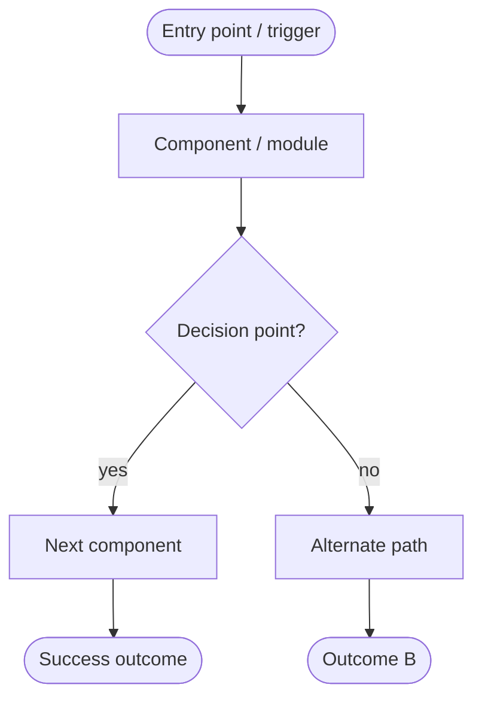
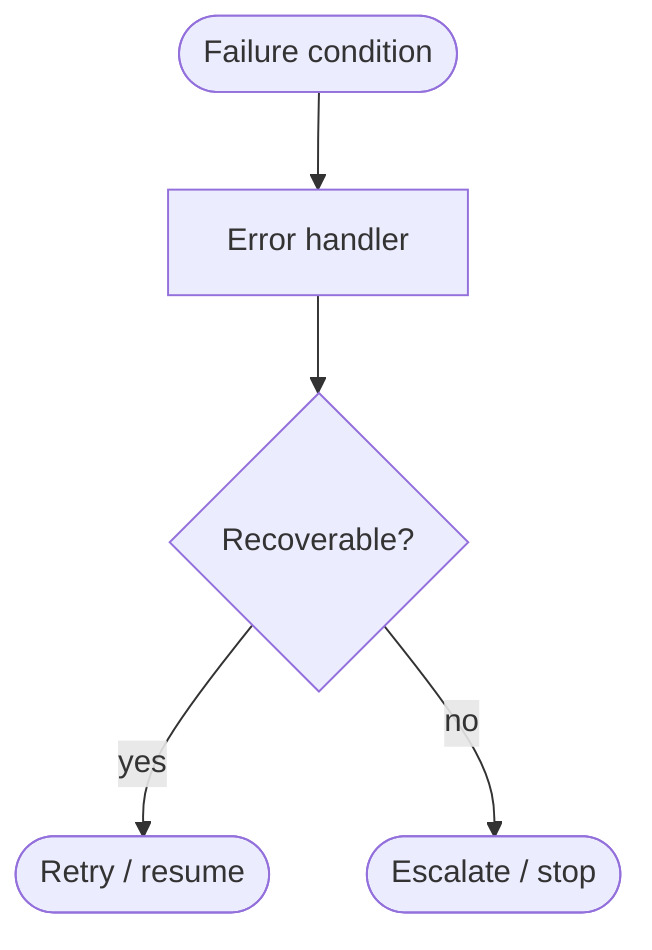

# [Feature Name] — Mermaid Flow Diagram

## [Primary Flow Name, e.g. "Happy Path: setup workflow"]

## [Fallback / Error Flow]

## Component Legend

| Node | Meaning |
|------|---------|
| `[Name]` | What this component does in this feature |
| `{Name}` | Decision point — branches on a condition |
| `([Name])` | Terminal node — entry point or final outcome |
| `...` | ... |
