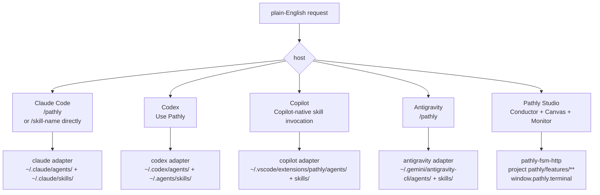
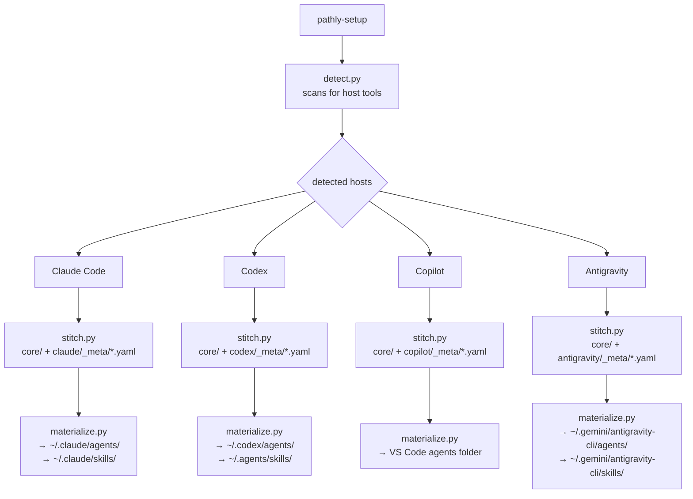

# Pathly Adapters Flow Diagram

How a user invokes Pathly from each supported host, what install produces, and
where files land.

> **Primary runtime is headless, board-driven orchestration.** Pathly's design center is the
> Studio **Start** button: `POST /runner/start` → the supervisor drives the FSM and spawns each
> pipeline stage as a **visible PTY tab**, agent-by-agent, with no human in the per-step loop,
> while a human supervises through the Command Center board (goals → task-DAG → executors). The
> per-host `/pathly` invocations below are the **interactive (secondary)** affordance. See
> [WHAT_IS_PATHLY.md](WHAT_IS_PATHLY.md).

## Host Entry Points

The interactive entry points below are the **secondary** affordance — the primary path is the
headless Studio runner above. Pathly exposes four interactive entry points:

- Claude Code: via the `/pathly` dispatcher (`/pathly go`, `/pathly build`, etc.) or direct skill invocations (`/go`, `/build`, `/start`, etc.)
- Codex: `Use Pathly ...` (natural language)
- Antigravity: `/pathly ...` slash commands (Gemini CLI layout)
- Pathly Studio: `pathly-studio`, then use Canvas, Plan, Monitor, Conductor,
  and Terminal inside the local desktop UI.

`pathly-setup` is the install-time CLI only — it deploys agents and skills; it is not a runtime workflow command.



## Install Flow



## What Files Get Deployed Where

### Claude Code

```text
~/.claude/
├── agents/                    ← 14 stitched behavioral contracts
│   ├── builder.md
│   ├── reviewer.md
│   ├── architect.md
│   └── ... (11 more)
├── skills/                    ← stitched skill files (nested: each skill is a folder)
│   ├── pathly/
│   │   └── SKILL.md           ← main dispatcher
│   ├── pathly-build/
│   │   └── SKILL.md
│   ├── pathly-review/
│   │   └── SKILL.md
│   ├── pathly-team/
│   │   └── SKILL.md
│   ├── pathly-test/
│   │   └── SKILL.md
│   ├── pathly-commit/
│   │   └── SKILL.md           ← transition-action (spawned by orchestrator)
│   ├── pathly-archive-artifacts/
│   │   └── SKILL.md           ← transition-action (spawned by orchestrator)
│   └── pathly-*/              (one folder per sub-skill, all prefixed)
└── plugins/pathly/
    └── templates/pathly plan/
        └── *.template.md
```

Source: `src/pathly_data/adapters/claude/_meta/*.yaml` + `src/pathly_data/core/` content
Plugin manifest: `src/pathly_data/adapters/claude/.claude-plugin/plugin.json`

### Codex

```text
~/.codex/
├── agents/                    ← stitched optional named role contracts (.toml)
└── plugins/pathly/            ← local plugin bundle, templates, flows, skill copies

~/.agents/
└── skills/                    ← stitched Codex skills (natural language, not slash commands)
```

Source: `src/pathly_data/adapters/codex/_meta/*.yaml` + `src/pathly_data/core/` content
Plugin manifest: `src/pathly_data/adapters/codex/.codex-plugin/plugin.json`
Public marketplace metadata: `.agents/plugins/marketplace.json`

### Copilot

```text
VS Code agents folder/
└── stitched agent + skill files (Copilot-compatible format)
```

Source: `src/pathly_data/adapters/copilot/_meta/*.yaml` + `src/pathly_data/core/` content

## Host-Specific Invocation

### Claude Code

All Pathly commands go through the `/pathly` dispatcher. Sub-skills are installed
with a `pathly-` prefix so they never collide with other tools' slash commands.

```text
Command                   Purpose
──────────────────────────────────────────────────────────────────────
/pathly start             welcome screen + journey map
/pathly go                director routes intent (describe what you want)
/pathly build             implement next conversation (auto-detects feature)
/pathly storm             brainstorm with architect
/pathly plan              create/update feature plan (auto-detects feature)
/pathly goalize           create a goal + task-DAG from chat (interactive)
/pathly review            code review
/pathly test              run acceptance tests (auto-detects feature)
/pathly debug             investigate a bug
/pathly explore           explore codebase (explorer + scout-flow)
/pathly po                clarify requirements with PO
/pathly meet              consult a role mid-flow
/pathly verify*           check for stale feedback
/pathly pause             pause session
/pathly end               retro + archive
/pathly retro             write retrospective (auto-detects feature)
/pathly team              run full team pipeline (auto-detects feature)
/pathly scout-path        targeted code-path scout (read-only lookup)
/pathly archive           archive completed feature (auto-detects feature)
/pathly lessons           promote lessons from retros
/pathly prd-import        import a PRD file
/pathly help              state-aware menu
/pathly fix               resolve open feedback for active feature
/pathly ff                fast-forward FSM to next state (skips current stage agent)
/pathly back              roll back FSM one state (with confirmation)
/pathly status            cross-feature dashboard (all active flows + states)
/pathly log               event timeline for active or named feature
/pathly design            generate DESIGN.md visual spec (after plan, before build)
```

*`/pathly verify` dispatches to `verify-state` (different stem from all other `/pathly <x>` → `<x>` pairs).

### Codex

```text
Use Pathly help
Use Pathly flow for checkout-flow
Use Pathly po for checkout-flow
Use Pathly to debug checkout button does nothing
Use Pathly to explore how checkout state flows
```

Current Codex builds do not expose `/pathly` slash commands. Use explicit
natural-language invocation. If Codex replies by inspecting the current repo
instead of using Pathly, the plugin was not selected — retry with `Use Pathly ...`.
Generated skills prepend a Codex execution contract: a named Pathly role is used
only when exposed as callable; otherwise lifecycle work runs in the current
agent, and generic delegation is used only when requested and permitted.

### Copilot

```text
@pathly start
@pathly go
@pathly build
@pathly end
@pathly help
```

Invocation syntax varies by VS Code / Copilot version. If `@pathly` is not available in your
Copilot chat, try referencing the agent by name (e.g. `#pathly`) or check Copilot chat settings
after install.

### Pathly Studio

```text
pathly-studio
```

Studio is a local UI over the same files and HTTP runtime:

- Command Center is the board — goals, task-DAGs, artifacts, decisions, questions.
- Pipeline shows the selected feature's FSM stage stepper + a global live engine board.
- DB Explorer surfaces telemetry: cost/token rollups, the event stream, and traces.
- Markdown Editor edits project markdown with one-shot AI actions (Split, Analyze, Diagram).
- Canvas reads and edits bundled + user flow YAMLs (graph + raw YAML, synced).
- Settings holds app + runtime configuration.

A floating Engines dock monitors every live CLI engine; a full Terminal hosts the PTY
tabs — mini and full views share one xterm instance per `tabId` through `xtermRegistry`
(hiding a view preserves the process; the bin action kills and removes the instance).

## pathly-setup Commands

```bash
pathly-setup                          # detect hosts; launch interactive menu
pathly-setup --dry-run                # preview what would be written
pathly-setup --apply                  # install into all detected hosts
pathly-setup claude --apply           # install for Claude Code only
pathly-setup codex --apply            # install for Codex only
pathly-setup copilot --apply          # install for Copilot / VS Code only
pathly-setup antigravity --apply      # install for Antigravity (Gemini CLI) only
pathly-setup --repair                 # overwrite Pathly-owned files
pathly-setup --force                  # overwrite all files, even non-Pathly-owned
pathly-setup --uninstall              # remove all Pathly-owned files
```

Dry-run output shows: detected hosts, Pathly version, planned adapter writes,
existing files that would be replaced, final start command per host.

## Stitch: Core + Adapter Metadata

`src/pathly_data/core/skills/` contains skill *logic* in natural language. Each
adapter renders role directions for its host. Codex prepends
`adapters/codex/SKILL_EXECUTION.md`; Claude may add tool-specific spawn calls:

```
# src/pathly_data/core/skills/team.md
Delegate implementation to the builder agent.
Then delegate review to the reviewer agent.

# src/pathly_data/adapters/claude/_meta/go_skill.yaml  (adds Agent() spawn calls for Claude Code)
Spawn Agent(subagent_type="builder") for implementation.
Spawn Agent(subagent_type="reviewer") for review.
```

This keeps `core/` host-neutral. A new host adapter only needs new `_meta/` files.
