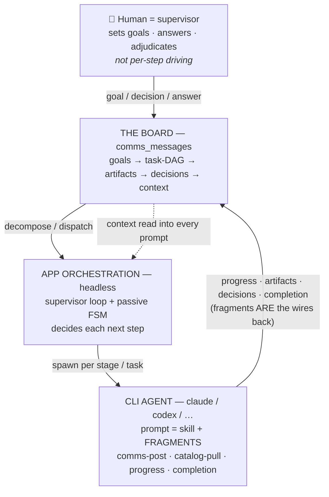
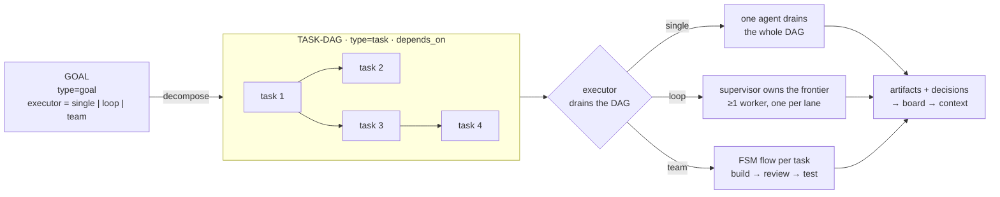
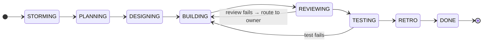

# What Pathly Is

> **Pathly is a board-driven control plane for orchestrating *headless* multi-agent software development.** A human supervises through a visual board — setting goals, answering questions, adjudicating decisions — while an application drives AI coding agents through a governed pipeline, one step at a time, with **no human in the per-step loop**.
>
> Typing `/pathly` slash-commands into a single CLI is a **secondary** affordance, not the primary product.

This document is the north star: read it first. For package layout see [PATHLY_ARCHITECTURE.md](PATHLY_ARCHITECTURE.md); for the install/adapter surface see [ARCHITECTURE.md](ARCHITECTURE.md).

---

## The one picture

```
        HUMAN = SUPERVISOR   (sets goals · answers questions · adjudicates)
              │  goal / decision / answer          ← NOT per-step driving
              ▼
   ╔══════════════════════════════════════════════════════════╗
   ║              THE BOARD   (comms_messages)                  ║   the substrate:
   ║   goals → task-DAG → artifacts → decisions → context       ║   everything
   ╚═══════════════╤═══════════════════════════▲════════════════╝   routes through it
                   │ decompose / dispatch       │ progress · artifacts ·
                   ▼                            │ decisions · completion
   ┌───────────────────────────────┐           │
   │  APP ORCHESTRATION (headless)  │           │
   │  supervisor loop + passive FSM │           │   the app decides each
   │  decides each next step        │           │   next step; a 'human'
   └───────────────┬───────────────┘           │   target in headless
                   │ spawn per stage / task     │   mode is an ERROR
                   ▼                            │
   ┌───────────────────────────────┐           │
   │  CLI AGENT  (claude/codex/…)   │───────────┘
   │  prompt = skill + FRAGMENTS    │   fragments ARE the wires back to the
   │  comms-post · catalog-pull ·   │   board: read/write/update context,
   │  progress-log · completion     │   post progress, report completion
   └───────────────────────────────┘
```

Read it as a loop: the human seeds the **board**, the **app** decides and spawns the next agent, the **agent** does the work and connects back to the board through **fragments**, and the app advances — repeating until done.

The same loop as a graph:



---

## 1. The board is the substrate

Everything in Pathly is mediated by a DB-backed message board (`comms_messages` + `comms_artifacts`, served at `/comms/*`). It is the Studio **Command Center** surface and is injected into every agent prompt as governance + semantic context.

```
   GOAL  ──decompose──►  TASK-DAG  ──run──►  ARTIFACTS + DECISIONS  ──►  CONTEXT
 (type=goal,           (type=task,         (type=artifact,            (read back into
  executor=            depends_on,          decision, warning,         every agent's
  single|loop|team)    claim/complete/fail)  question, status)          next prompt)
```

- A **goal** is decomposed into a **task-DAG** (dependency-ordered `type=task` rows).
- An **executor** (`single` · `loop` · `team`) drains the DAG — the board *is* the queue, not an agent's memory.
- Agents post **artifacts, decisions, discoveries, warnings, and progress** back to the board; the board is read back into the next agent's prompt. No agent is blind to what came before.



The human's role here is **supervisory**: create goals, answer non-blocking questions, adjudicate escalations — outside the per-step loop.

### 1a. Two axes of "layering" — don't conflate them

Pathly is a **blackboard system** in the classic sense (Hearsay-II / BB1): one shared board, stateless
knowledge-source agents that never call each other (they connect back *only* through fragments), and a
separate control component (the passive FSM + supervisor loop) that decides what runs next. "The board
is the only memory" is the load-bearing constraint, and fragments enforce it structurally.

Within that, the word "layer" gets used for **two orthogonal things that compose differently**. Keep
them distinct:

| | **Abstraction levels** (a blackboard property) | **Scope tiers** (an inheritance chain) |
|---|---|---|
| Ladder | `task → goal → feature → project` | `global (~/.pathly) → project → feature` |
| Backed by | `goal_id` / `type` columns; decompose + aggregate KSs | `scope` column; `pathly/abilities/`, board scope |
| Compose rule | **aggregate upward** — children complete ⇒ parent completes | **override by nearest scope** — project ability overrides global |
| Blackboard? | **Yes** — signal→word→phrase abstraction ladder (`goal_decomposer` = downward KS; completion = upward KS) | **No** — this is lexical scoping / prototype-chain override |

- **Abstraction levels aggregate.** Finishing a task-DAG *raises* its goal; a goal is itself a
  contribution at the goal level. This is the genuine hierarchical-blackboard axis.
- **Scope tiers resolve by override.** The *nearest* scope wins (a project `plan/react-web.md`
  ability shadows a global one of the same id); nothing "aggregates" from global up to feature.

Because they compose differently, don't expect aggregation semantics where there is override
semantics, or vice-versa. Note also that both `scope` (tier) and `goal_id` (level) are plain columns
on the **one flat `comms_messages` table** — so a board boundary is a **query predicate, not a
structural wall**: every board read must carry its `scope` filter, or context bleeds across tiers.

A fuller blackboard-lens critique + the open invariants this implies live in
[`pathly/explorations/blackboard-architecture-assessment/ASSESSMENT.md`](../pathly/explorations/blackboard-architecture-assessment/ASSESSMENT.md).

---

## 2. How a headless run actually works

The FSM is a **passive decision layer** — it computes *what to do next* (state, role, prompt, which CLI) but **never launches a process**. A separate **supervisor loop** owns execution.

```
  supervisor loop                         FSM (passive)              CLI agent
  ───────────────                         ───────────                ─────────
   │  POST /next_action  ───────────────►  compute next state,
   │                                       role, prompt, adapter
   │  ◄───────────  agent_hint.instructions (a COMPLETE prompt) + preferred_adapter
   │
   │  spawn the chosen CLI headlessly  ──────────────────────────►  run the agent
   │  (prompt injected via -p argv;                                  (writes files,
   │   TERMINAL_SPAWN tells Studio to                                 posts to board,
   │   open a PTY for the stage)                                      writes AGENT_DONE)
   │  ◄──────────────────────────────────────────────────────────  PTY exits
   │
   │  read AGENT_DONE.summary (authoritative result)
   │  POST /complete_stage  ────────────►  resolve gates / feedback,
   │                                       compute next state
   └───────────────────────────────────  ...repeat until DONE
```

Key facts (each independently confirmed by reading the code):
- The supervisor decides every next step; **a `human` target in headless mode is treated as an error** (`cannot block waiting for human in headless mode`).
- The agent's semantic result is **`AGENT_DONE.summary`** written to the DB by the agent itself (via the `completion-report` fragment) — *not* scraped from stdout. Stdout is only used for `session_id` + `cost_usd`. The same fragment writes an explicit **`AGENT_DONE.outcome`** (`success`/`failed`, + `error`) — the supervisor treats a clean process exit with `outcome:"failed"` as a task failure, not a success (silent-failure guard).
- The same flow is **adapter-agnostic**: different stages can route to different CLI back-ends (`claude`, `codex`, …) via the flow's `adapter_map`.

The full `team` pipeline the FSM walks (trimmed flows like `team-build`, `consultation`, `debug`, and `quick-fix` are subsets or reshapes of it — and a user can author any flow in the Canvas):



Failure feedback is **routed to the role that owns the root cause** (a design flaw → architect, a scope gap → po/planner) which fixes its artifact before the builder re-implements — not blindly bounced back to the builder.

---

## 3. Fragments: how agents connect to Pathly

An agent's prompt is **composed**, not hand-written: a stage **skill body** is stitched together with reusable **fragments** at the moment the stage runs (`compose_skill`, manifest `composition.yaml`, DB-overridable via `skill_composition`).

**Fragments are the un-editable system-prompt layer** — the wires every agent uses to talk to Pathly. They own all the board CRUD, context retrieval, progress, and completion:

| Fragment | What it wires the agent to do |
|---|---|
| `comms-post` | **write** to the board — decisions, discoveries, warnings, artifacts, questions |
| `catalog-pull` | **read** board/catalog context on demand (artifact sections) |
| `code-query` | ask Pathly's **code graph** (`POST /code/query`) — symbols, callers, impact — before Grep; safe-nulls to Grep when the backend is off |
| `progress-logging` | emit **phase telemetry** (`PHASE_START`/`PHASE_DONE`) mid-run |
| `completion-report` | write the **authoritative result** (`AGENT_DONE`: summary, tokens, cost) |
| `feedback-protocol` | honor the feedback-file gate + escalation routing |
| `spawn-rules` | delegate to sub-agents (gated on adapter `can_spawn`) |
| `scout-choreography` | three-phase parallel context gathering |
| `board-init` | seed a new board / feature with its initial context |
| `board-start-context` | inject the board's starting context block at run start |
| `task-dag-post` | post decomposed tasks as a `depends_on` DAG (planner path) |
| `artifact-register` | register a produced file as a board artifact |
| `artifact-transform` | transform / derive an artifact (summarize, split, analyze) |
| `client-file-output` | capture engine output via a file, not the stdout tail |
| `consult` | mid-flow consultation with another role |

> The standing goal: **every prompt that Pathly sends to a CLI should flow through these fragments**, so all agents connect to the board the same way. (This was the *Unified CLI Composition* initiative — now largely shipped; design archived under `pathly/features/.archive/unified-cli-composition/` + `unified-cli-finish/`.)

---

## 4. Two delivery modes (and which is primary)

| Mode | Trigger | How the prompt reaches the CLI | Skill files on disk? | Role |
|---|---|---|---|---|
| **Runner (headless)** | Studio Start / board run / goal execute | supervisor composes the full prompt and injects it via `-p` argv | **No** — assembled in Python at runtime | **PRIMARY** |
| **Interactive** | A human types `/pathly build` | the CLI reads `~/.claude/skills/pathly-*.md` | Yes — `pathly-setup --apply` writes them | secondary |

In runner mode Pathly is the single source of truth for prompt content; the CLI receives the complete prompt and exits. The interactive on-disk skills exist for humans who want to drive a single CLI by hand — useful, but not the design center.

> **Why this matters for the docs:** the pip package's job (`pathly-setup`) is to *install the interactive skill files*, which historically made the docs read interactive-first. The engine — supervisor, FSM, board, executors, Studio — is built headless-first. This document corrects the framing: **headless board-orchestration is the goal; interactive is the add-on.**

---

## 5. Core concepts (glossary)

- **Board** — the `comms_messages` substrate; the Command Center surface; injected into every prompt.
- **Goal → Task-DAG → Executor** — a goal decomposes into a dependency-ordered task DAG, drained by a `single` / `loop` / `team` executor.
- **Feature** — the unit of work (`project_root` + feature key); its state + artifacts live directly under `pathly/features/<feature>/` (STATE.json, plan docs, `feedback/`, `goals/`, …). Legacy features under `pathly/plans/<feature>/` are still resolved for back-compat.
- **FSM** — the passive pipeline brain (`STORM → PLAN → DESIGN → BUILD → REVIEW → TEST → RETRO → DONE`); computes the next step, never spawns.
- **Supervisor** — the loop that actually drives: poll FSM → spawn the stage's CLI → read the result → advance.
- **Adapter** — a CLI back-end (`claude`, `codex`, `copilot`, `antigravity`); the same flow can route stages to different adapters.
- **Skill** — a per-stage workflow body; **Fragment** — a reusable prompt block composed onto skills.
- **Agent role** — director, architect, planner, po, builder, reviewer, tester, designer, explorer, … (contracts in `core/agents/`).
- **Rigor** — `nano` / `lite` / `standard` / `strict`: how much of the pipeline runs.

---

## The vision this is building toward

A user can **define, analyze, and create** agents, skills, and multi-agent flows in any shape — with help from CLI-spawning agents — drive them with **visual control through the board**, and **monitor them at runtime**. The board is the control plane; the agents are interchangeable workers; fragments are how they stay connected to Pathly.
