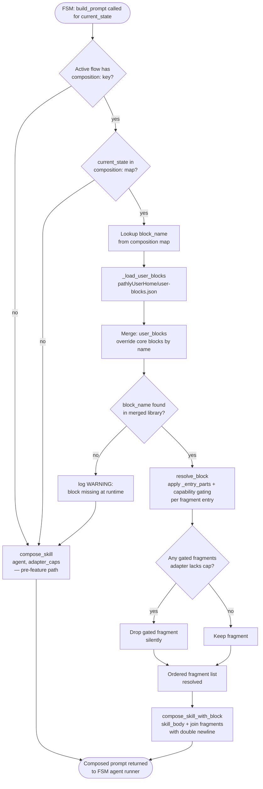
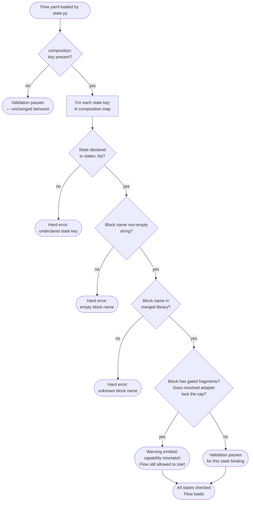
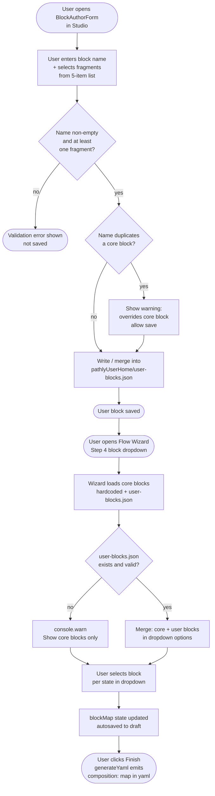

# composition-blocks — Flow Diagram

## Primary Flow: Stage → Block → Fragments → Composed Prompt

## Fallback / Validation Flow (load time)

## Author + Store Flow (Studio, Conv 3)

## Component Legend

| Node | Meaning |
|---|---|
| `[Name]` | Processing step — a function call or data operation |
| `{Name?}` | Decision point — branches on a boolean condition |
| `([Name])` | Terminal node — final outcome or entry trigger |
| `compose_skill` | Pre-feature composition path (unchanged) |
| `resolve_block` | New function in compose.py; applies capability gating |
| `compose_skill_with_block` | New function in compose.py; assembles skill + block fragments |
| `_load_user_blocks` | Private helper; returns `{}` on any file/parse error |
| `blockMap` | Wizard state: `Record<string, string>` — state → block name |
| `generateYaml` | Extended to accept `blockMap`; emits `composition:` key conditionally |
