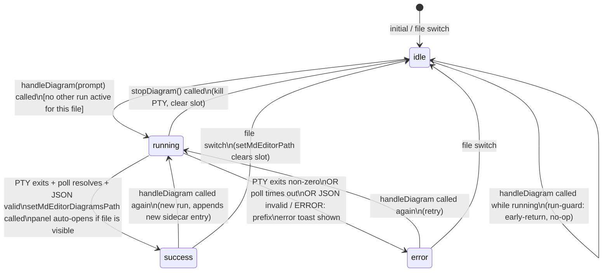

# Flow Diagram — md-diagram-conversion

**Branch:** `claude/md-diagram-conversion-wze4x3`
**Layer:** Studio (Electron / React renderer)

Reference diagrams for builders. Source: ARCHITECTURE_PROPOSAL.md §2, §5, §7.

---

## 1. Component tree

Lightly annotated copy of ARCHITECTURE_PROPOSAL.md §2. Indentation = containment.

```
MarkdownEditor.tsx                        [edit — add panel mount]
├─ <AnalysisPanel/>                       existing — absolute right panel, z-index 20
├─ <DiagramGalleryPanel/>                 NEW — same slot pattern, one panel open at a time
│   ├─ panel header (title + close)
│   ├─ [+ New ▾] style picker            DIAGRAM_STYLE_GROUPS → onRun(style) → hook spawn
│   ├─ scrollable body
│   │   └─ DiagramCard[]                 from useDiagramSidecar; keyed by diagram.id
│   │       ├─ style badge               data-style={diagram.style}: mermaid | ascii | plantuml
│   │       ├─ status · date · engine    ISO date, engine name from sidecar entry
│   │       ├─ <DiagramRender mode="card"/>    compact preview (stub in Conv 4; real in Conv 5)
│   │       │   ├─ <MermaidView/>        style === 'mermaid' — async SVG via mermaid.render()
│   │       │   ├─ <pre>                 style === 'ascii'   — text node, var(--font-mono)
│   │       │   └─ <pre> + notice        style === 'plantuml' — source + "not bundled" notice
│   │       └─ View · Regenerate · Delete  (all type="button")
│   └─ <DiagramLightbox/>                NEW — lightbox state owned by panel, not card
│       └─ <DiagramRender mode="full"/>  same component, mode prop removes size clamp
│
└─ <EditorHeader/>                        [edit — add 3rd ActionPill]
    ├─ <ActionPill ariaName="Split"…/>    existing
    ├─ <ActionPill ariaName="Analyze"…/>  existing
    └─ <ActionPill ariaName="Diagram"…/>  NEW — Network icon, tone="green"
        ├─ Run                            openDiagramPreview() → SendPreviewModal → handleDiagram()
        ├─ gear (settings)                <PromptPeekModal presets={DIAGRAM_PRESETS}/>
        └─ result chip "🖼 N"             onClick → toggle mdEditorDiagramPanelOpen
```

---

## 2. Data flow: Run clicked → sidecar written → panel opens

```
┌─ USER ─────────────────────────────────────────────────────┐
│                                                             │
│  clicks Diagram pill Run button                             │
│           │                                                 │
│           ▼                                                 │
│  PromptPeekModal (select style preset)                      │
│           │                                                 │
│           ▼                                                 │
│  SendPreviewModal ("Generate Diagram" + Network icon)       │
│           │  confirm                                        │
└───────────┼─────────────────────────────────────────────────┘
            │
            ▼
┌─ EditorHeader.tsx ─────────────────────────────────────────┐
│  submitPendingRun → case 'diagram': handleDiagram(prompt)  │
└───────────┬─────────────────────────────────────────────────┘
            │
            ▼
┌─ useEditorDiagramAction.ts ────────────────────────────────┐
│                                                             │
│  resolveActionPrompt(prompt, 'development/diagram', 'diagram')
│           │                                                 │
│           ▼                                                 │
│  composeClientSkill(skill, cli, {kind:'diagram'})           │
│           │  → full fragment-composed prompt               │
│           ▼                                                 │
│  buildCliArgv(diagramCli, composedPrompt)                   │
│    → buildHeadlessArgv → dash-safe argv array               │
│           │                                                 │
│           ▼                                                 │
│  window.pathly.terminal.spawn(argv, {cwd})                  │
│  addTab / openTab → terminal tab visible in Studio          │
│                                                             │
│  setMdEditorAction(forFile, 'diagram', {status:'running'})  │
│    → pill shows spinner                                     │
│                                                             │
│  attachProgress(tabId, …) → milestone toasts + timer       │
└───────────┬─────────────────────────────────────────────────┘
            │ PTY running
            ▼
┌─ CLI AGENT (headless) ─────────────────────────────────────┐
│                                                             │
│  reads architecture.md                                      │
│  generates Mermaid flowchart source                         │
│  calls readSidecar(file) via window.pathly.fs               │
│  pushes new Diagram entry                                   │
│  calls writeSidecar(file, sidecar)                          │
│    → writes architecture.md.diagrams.json                   │
│  writes AGENT_DONE to EVENTS.jsonl                          │
│  PTY exits                                                  │
└───────────┬─────────────────────────────────────────────────┘
            │ PTY exit event
            ▼
┌─ useEditorDiagramAction.ts (post-exit) ────────────────────┐
│                                                             │
│  updateTabStatus / closeTab                                 │
│           │                                                 │
│           ▼                                                 │
│  pollForFile(forFile + '.diagrams.json')                    │
│    5 × 600ms polls via window.pathly.fs.read                │
│           │  poll resolves                                  │
│           ▼                                                 │
│  parse JSON → validate {diagrams:[…]} shape                 │
│           │  valid                                          │
│           ▼                                                 │
│  setMdEditorDiagramsPath(sidecarPath, forFile)              │
│    → uiStore setter:                                        │
│         mdEditorDiagramsPaths[forFile] = sidecarPath        │
│         IF forFile === s.mdEditorPath:                      │
│           mdEditorDiagramPanelOpen = true    ◄── auto-open  │
│                                                             │
│  setMdEditorAction(forFile, 'diagram', {status:'success'})  │
│    → pill shows result chip "🖼 1"                          │
└───────────┬─────────────────────────────────────────────────┘
            │ store update
            ▼
┌─ DiagramGalleryPanel (React) ──────────────────────────────┐
│                                                             │
│  mdEditorDiagramPanelOpen === true → panel renders         │
│           │                                                 │
│           ▼                                                 │
│  useDiagramSidecar:                                         │
│    diagramsPath changed → readSidecar(file)                 │
│    → setDiagrams(sidecar.diagrams)                          │
│           │                                                 │
│           ▼                                                 │
│  diagrams.map(d => <DiagramCard key={d.id} …/>)            │
│    → DiagramRender mode="card"                              │
│      → MermaidView (async SVG) | <pre> | plantuml notice   │
│           │                                                 │
│  "View" clicked → setLightboxDiagram(diagram)               │
│    → <DiagramLightbox diagram={…} onClose={…} />           │
│      → DiagramRender mode="full" + zoom/pan                 │
└────────────────────────────────────────────────────────────┘
```

---

## 3. State machine — diagram action slot

The `MdEditorActionSlot` for `'diagram'` follows the same FSM as `'split'` and `'analyze'`.
One instance per file (keyed by `filePath`).



**Side effects on transition:**

| Transition | Side effects |
|---|---|
| idle → running | `addTab`, `openTab`, `attachProgress`, pill spinner |
| running → success | `setMdEditorDiagramsPath` (sets sidecar path + auto-opens panel), pill chip |
| running → error | error toast, `closeTab`, pill error state |
| any → idle (file switch) | `setMdEditorPath` clears `mdEditorDiagramPanelOpen` = false |
| stopDiagram | `kill` PTY, `closeTab`, `clearIfStill` guard clears slot |

---

## 4. Dependency direction (ARCHITECTURE_PROPOSAL.md §7)

All arrows point downward or sideways. No upward imports. No component reaches into `main/`.

```
DiagramGalleryPanel.tsx
  ├──► useDiagramSidecar.ts
  │       └──► diagramSidecar.ts
  │               └──► window.pathly.fs          [IPC bridge leaf]
  ├──► DiagramCard/DiagramCard.tsx
  │       └──► DiagramRender/DiagramRender.tsx
  │               ├──► MermaidView.tsx
  │               │       └──► import('mermaid')  [async chunk leaf]
  │               └──► (ascii / plantuml: no sub-import)
  ├──► DiagramLightbox/DiagramLightbox.tsx
  │       └──► DiagramRender/DiagramRender.tsx    [shared — same component]
  └──► uiStore                                    [sibling store]

useEditorDiagramAction.ts
  ├──► editorCli.ts
  │       └──► cliEngine.ts                       [existing service]
  ├──► commentUtils.ts (getSpawnCwd)              [existing util]
  ├──► skillCompose.ts                            [existing service]
  ├──► terminalStore / uiStore / toastStore       [sibling stores]
  └──► editorProgress.ts                          [sibling util]

EditorHeader.tsx
  ├──► useEditorDiagramAction.ts                  [new hook]
  ├──► diagramPresets.ts                          [new constants]
  ├──► ActionPill / PromptPeekModal / SendPreviewModal  [existing shared]
  └──► uiStore (selectors)                        [sibling store]
```

**Prohibited directions (architecture bugs if violated):**

```
uiStore        ✗──► any component
diagramSidecar ✗──► any store or component
main/          ✗──► renderer/  (IPC bridge is the only crossing)
```
